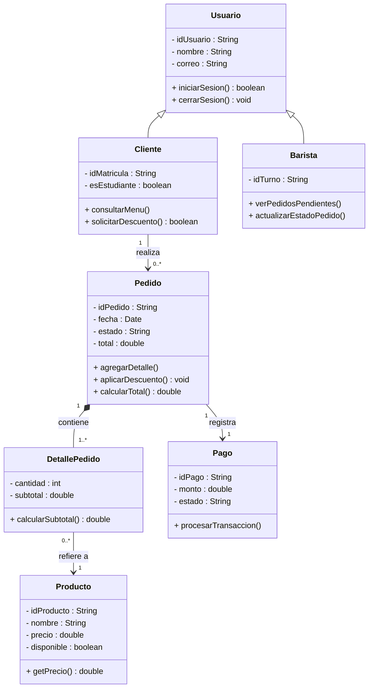

# Diagrama de Clases — Coffee Campus App

```mermaid
classDiagram
    class Usuario {
        - idUsuario : String
        - nombre : String
        - correo : String
        + iniciarSesion() boolean
        + cerrarSesion() void
    }

    class Cliente {
        - idMatricula : String
        - esEstudiante : boolean
        + consultarMenu()
        + solicitarDescuento() boolean
    }

    class Barista {
        - idTurno : String
        + verPedidosPendientes()
        + actualizarEstadoPedido()
    }

    class Producto {
        - idProducto : String
        - nombre : String
        - precio : double
        - disponible : boolean
        + getPrecio() double
    }

    class Pedido {
        - idPedido : String
        - fecha : Date
        - estado : String
        - total : double
        + agregarDetalle()
        + aplicarDescuento() void
        + calcularTotal() double
    }

    class DetallePedido {
        - cantidad : int
        - subtotal : double
        + calcularSubtotal() double
    }

    class Pago {
        - idPago : String
        - monto : double
        - estado : String
        + procesarTransaccion()
    }

    Usuario <|-- Cliente
    Usuario <|-- Barista

    Cliente "1" --> "0..*" Pedido : realiza
    Pedido "1" *-- "1..*" DetallePedido : contiene
    DetallePedido "0..*" --> "1" Producto : refiere a
    Pedido "1" --> "1" Pago : registra
```
