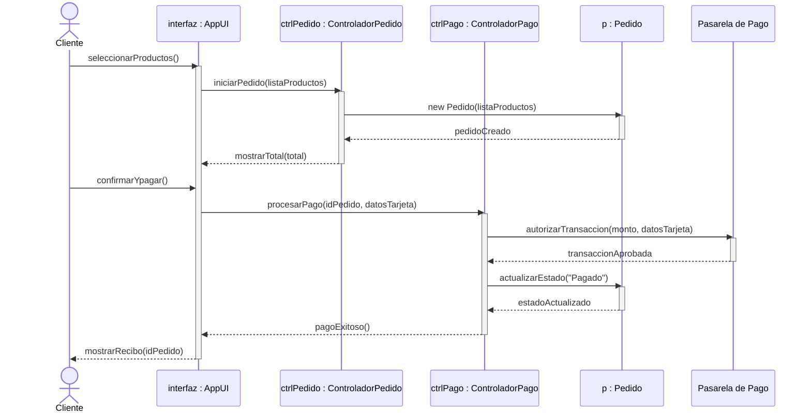

# Diagrama de Secuencia — Coffee Campus App
## Escenario: Realizar Pedido y Procesar Pago

```mermaid
sequenceDiagram
    actor Cliente
    participant UI as interfaz : AppUI
    participant CP as ctrlPedido : ControladorPedido
    participant CPago as ctrlPago : ControladorPago
    participant Pedido as p : Pedido
    participant Pasarela as Pasarela de Pago

    Cliente ->> UI: seleccionarProductos()
    activate UI
    UI ->> CP: iniciarPedido(listaProductos)
    activate CP
    CP ->> Pedido: new Pedido(listaProductos)
    activate Pedido
    Pedido -->> CP: pedidoCreado
    deactivate Pedido
    CP -->> UI: mostrarTotal(total)
    deactivate CP

    Cliente ->> UI: confirmarYpagar()
    UI ->> CPago: procesarPago(idPedido, datosTarjeta)
    activate CPago
    CPago ->> Pasarela: autorizarTransaccion(monto, datosTarjeta)
    activate Pasarela
    Pasarela -->> CPago: transaccionAprobada
    deactivate Pasarela

    CPago ->> Pedido: actualizarEstado("Pagado")
    activate Pedido
    Pedido -->> CPago: estadoActualizado
    deactivate Pedido

    CPago -->> UI: pagoExitoso()
    deactivate CPago
    UI -->> Cliente: mostrarRecibo(idPedido)
    deactivate UI
```
